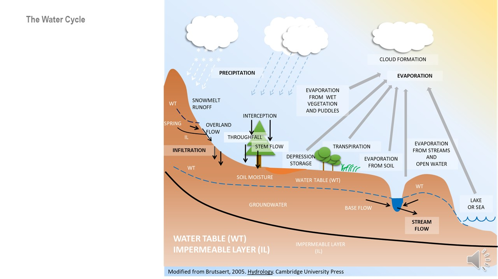

This is an [R Markdown](http://rmarkdown.rstudio.com) Notebook. When you execute code within the notebook, the results appear beneath the code. 

Try executing this chunk by clicking the *Run* button within the chunk or by placing your cursor inside it and pressing *Ctrl+Shift+Enter*. 

```{r}
plot(cars)
```

In a notebook file text not preceded by any symbols is interpreted as plain text. One of the most versatile symbols is the hash (#). It will accomplish multiple functions depending on how is used. You can used hashes to introduce format in your text. For instance:

"#" + Space + text = A big heading

# A big heading

"##" + Space + text = A smaller heading

## A smaller heading

"###" + Space + text = An even smaller heading

### An even smaller heading

Hashes can also be used within a code chunk to add comments to the code. For instance

```{r}
plot(cars)# a plot of distance against speed
```

The asterisk is another helpful symbol. You can make a simple bulleted list with asterisks

* First item
* Second item

An even put in a picture (the file image.jpg needs to be in the same folder/directory as this file)



Add a new chunk by clicking the *Insert Chunk* button on the toolbar or by pressing *Ctrl+Alt+I*.

When you save the notebook, an HTML file containing the code and output will be saved alongside it (click the *Preview* button or press *Ctrl+Shift+K* to preview the HTML file).

The preview shows you a rendered HTML copy of the contents of the editor. Consequently, unlike *Knit*, *Preview* does not run any R code chunks. Instead, the output of the chunk when it was last run in the editor is displayed.

## Your homework:

* Change the title of this notebook to Notebook 0
* Change the name of the author for your name (Name + Surname(s))
* Change the date to today's date
* Change the output to word_document
* At the very beginning, add a picture of yourself and below write a short paragraph (three sentences) about your background.
* At the end (before the homework section), add a chunk to plot a histogram of a random sample of size 1000 from a normal distribution including the following lines: x = rnorm (1000); qplot (x)
* Save the output as a word document and submit it to CANVAS


